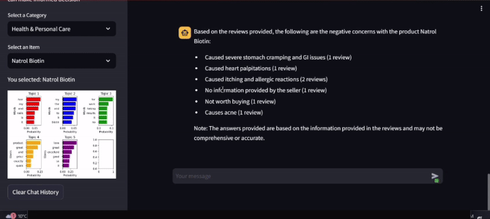

### product-review-gossiper: Unveiling Amazon Reviews

### What is this project about?

1. **Review Collection:** We've delved into the vast world of Amazon, collecting hundreds of reviews for over 400 unique products, capturing the essence of customer experiences.

2. **Embedded Feedback:** Every product holds a trove of feedback—positive, negative, and neutral. We've embedded these diverse perspectives, providing a holistic view.

3. **Unveiling Insights:** Utilizing advanced topic modeling techniques, we've dissected each review, unveiling the underlying features and aspects highlighted by reviewers. This allows for a peek into what matters most when considering a purchase.

4. **QDRANT Vector Store:** Storing these comprehensive embeddings efficiently, we've harnessed the power of QDRANT vector store for seamless retrieval and analysis.

### How does it work?

5. **Contextual Chatting:** When a user seeks information about a product, their query is embedded and scours the vector store for context. This valuable context then fuels conversations with llama2, our chatbot extraordinaire.

6. **Revealing Insights:** Our chatbot serves up a goldmine of insights! Users can unearth the positives, negatives, and even unknowns about a product. Plus, we've enhanced user experience by providing visual cues derived from Bertopic, aiding in framing questions about potential product pitfalls.

### Why use it?

This tool is a window into the real-world experiences of Amazon customers, empowering users to make informed decisions. Whether diving into specifics or seeking broad guidance, our chatbot equips you with nuanced insights and visual clues to navigate the product landscape with confidence.
### 
### Project Pipeline[Scroll Down for Visual Snippet] 
 
### Project Snippet

